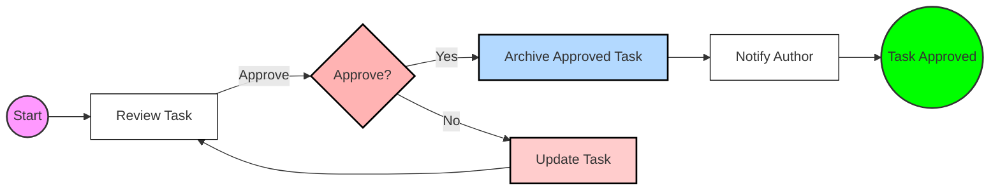

# AppFlow💡 Introduction

Are you ready to create the documentation site for your open source project?

## Introduction
Our solution allows you to build fully functional business applications without writing a single line of code. It empowers users to create, automate, and optimize processes, saving time, increasing productivity, and reducing costs.

## Key Features
### 1. Model Customer-Oriented Journeys & Interfaces
- Design user journeys visually using drag-and-drop tools.
- Create intuitive user interfaces with pre-built templates and configurable components.
- Personalize user experiences based on specific business needs.

### 2. Model, Configure, & Execute Complex Business Processes
- Define multi-step processes visually (e.g., approvals, reviews, escalations).
- Add conditional logic, dependencies, and decision paths for dynamic workflows.
- Test and deploy processes instantly.

### 3. Automate Workflows
- Automate repetitive tasks by linking events and triggers.
- Use customizable workflows to streamline approvals, reminders, and notifications.
- Eliminate manual interventions for better consistency.

### 4. Robotize Low Value-Added Tasks
- Assign repetitive or tedious tasks to software robots.
- Automate data entry, extraction, and synchronization across systems.
- Increase efficiency while reducing operational costs.

### 5. Generate & Classify Documents
- Automatically generate documents (e.g., invoices, contracts) from predefined templates.
- Classify documents using AI for faster organization and retrieval.
- Integrate document management with workflows.

### 6. Generate Dashboards & Structure Data
- Visualize key metrics and data with dynamic dashboards.
- Use drag-and-drop tools to structure data for reporting.
- Share dashboards across teams for real-time insights.

## Why Choose This Solution?
- **Save Time & Boost Productivity**: Automate repetitive tasks and focus on value-added activities.
- **Reduce Costs**: Minimize manual effort and errors with streamlined processes.
- **Increase Efficiency**: Make complex workflows simpler and faster.
- **Minimize Errors**: Leverage automation to reduce human intervention and improve accuracy.

## How It Works: A Step-by-Step Flow
### `Step 1`: Define Your Use Case
Identify the business process, task, or interface you want to digitize or automate.

### `Step 2`: Model Processes & Workflows
Use the visual process designer to map out your workflow:
- Define stages (e.g., Approval, Review, Execution).
- Set triggers, conditions, and decision points.

### `Step 3`: Configure Interfaces & User Journeys
- Drag and drop components to create forms, pages, or dashboards.
- Add input fields, dropdowns, buttons, and interactive elements.
- Preview the user journey and refine as needed.

### `Step 4`: Automate Tasks & Processes
- Assign automation to steps (e.g., send reminders, generate documents, update records).
- Configure robots for low-value tasks.

### `Step 5`: Generate Outputs
- Set up document templates for automatic generation.
- Define dashboard views for real-time tracking and insights.

### `Step 6`: Test & Deploy
- Test the application in a sandbox environment.
- Refine workflows, interfaces, or automation as needed.
- Deploy to production for live use.

:::info

## Support
For additional details or troubleshooting, consult the Developer Blocks for advanced customization or reach out to support.

:::
